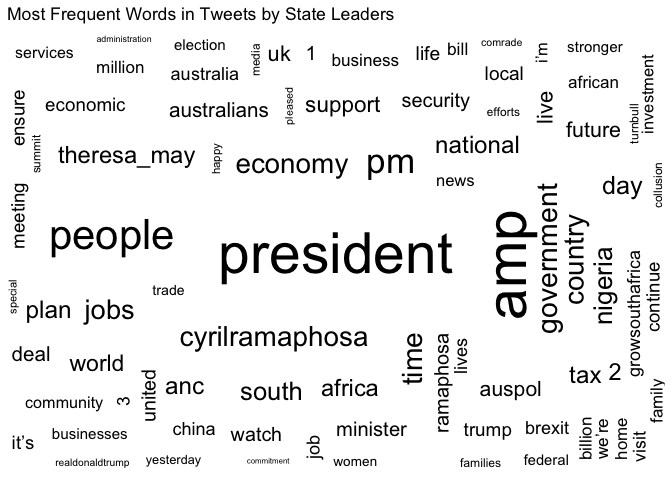
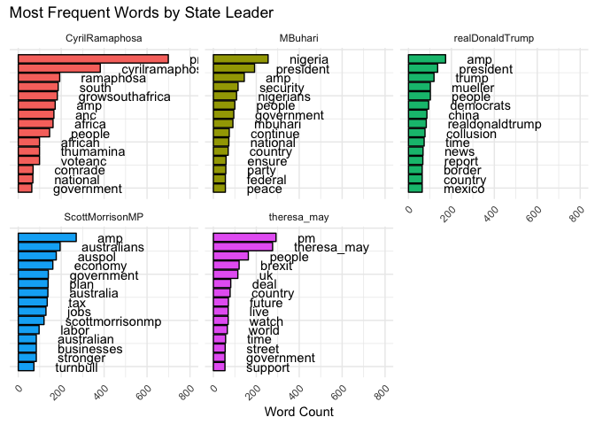
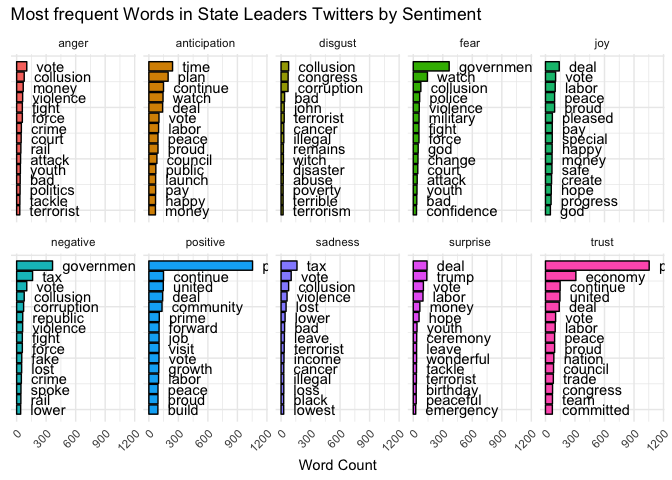
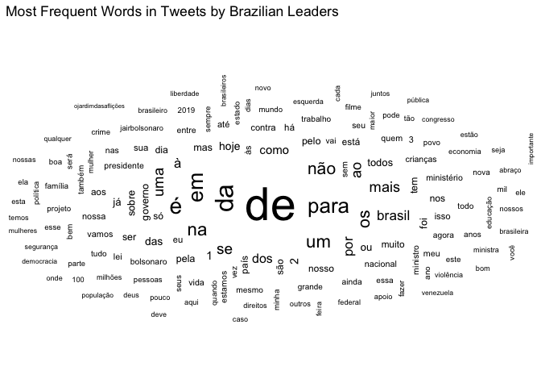
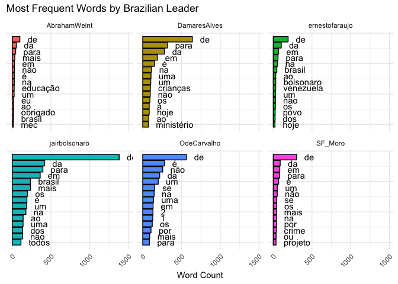

Twitter Analysis
================
Jess Robinson
June 9, 2019

``` r
#settings
knitr::opts_chunk$set(fig.path='Figs/',
                       warning=FALSE, message=FALSE)
```

``` r
#load libraries
library(tidyverse)
library(readr)
library(here)
library(knitr)
library(rtweet)
library(tidytext)
library(ggwordcloud)

set.seed(1234)
theme_set(theme_minimal())
```

State Leaders
=============

For the first part of my homework, I analyzed the tweets of a convenience sample of state leaders from English-speaking countries. These included the presidents or prime ministers of the United States, the United Kingdom, Nigeria, South Africa, and Australia.

Load Data
---------

``` r
may  <- get_timeline(user = "theresa_may", n = 1000) %>%
  select(screen_name, text, created_at)

morrison  <- get_timeline(user = "ScottMorrisonMP", n = 1000) %>%
  select(screen_name, text, created_at)

buhari <- get_timeline(user = "MBuhari", n = 1000) %>%
  select(screen_name, text, created_at)

trump <- get_timeline(user = "realDonaldTrump", n = 1000)  %>%
  select(screen_name, text, created_at)

ramaphosa <- get_timeline(user = "CyrilRamaphosa", n = 1000)  %>%
  select(screen_name, text, created_at)
```

Make List
---------

``` r
state_leaders <- c("Trump", "May", "Morrison", "Buhari", "Ramaphosa")
state_tweets <- list(trump, may, morrison, buhari, ramaphosa) %>%
  set_names(state_leaders) %>%
  map_df(as_tibble, .id = "State Leader") %>%
  group_by(screen_name) 
```

Tidy Text
---------

``` r
tidy_tweets <- state_tweets %>%
  unnest_tokens(word, text) %>%
  anti_join(stop_words, by = "word") %>%
  filter(word != "t.co") %>%
  filter(word != "https")
```

Word Cloud
----------

``` r
tidy_tweets %>%
group_by(word) %>%
  count(sort = TRUE) %>%
  ungroup() %>%
  top_n(n = 150, wt = n) %>%
  mutate(angle = 90 * sample(c(0, 1), n(), replace = TRUE, prob = c(70, 30))) %>%
  ggplot(aes(label = word, size = n, angle = angle)) +
  geom_text_wordcloud_area(rm_outside = TRUE) +
  scale_size(range = c(2, 15)) +
  ggtitle("Most Frequent Words in Tweets by State Leaders") +
  theme_minimal()
```



This world cloud shows the most frequent words used overall in these twitter accounts. Unsurprisingly, words like "president", "people", and the names of political parties occur quite often.

Most Frequent Words by Leader
-----------------------------

``` r
tidy_tweets %>%
  count(screen_name, word) %>%
  arrange(desc(n)) %>% 
  group_by(screen_name) %>% # 
  mutate(top = seq_along(word)) %>%
  filter(top <= 15) %>%
  ggplot(aes(x = -top, y = n, fill = screen_name)) + 
  geom_col(color = "black") +
  geom_text(aes(label = word), hjust = "left", nudge_y = 100) +
  labs(title = "Most Frequent Words by State Leader",
       x = NULL,
       y = "Word Count") +
  facet_wrap( ~ screen_name) +
  coord_flip() +
  theme(legend.position = "none",
        axis.text.x = element_text(angle = 45, hjust = 1),
        axis.ticks.y = element_blank(),
        axis.text.y = element_blank())
```



These charts show the most commons terms used by each state leader. Of interest is which domestic topics state leaders tend to talk about, such as Mueller on Trump's twitter and Brexit on May's twitter. Also of interest is how some state leaders talk about their own country very much, as in the case of Nigeria, versus how much other state leaders talk more about other countries, as is the case in Mexico.

Sentiment Anaylsis
------------------

``` r
(tweets_nrc <- tidy_tweets %>% 
  inner_join(get_sentiments("nrc")) %>%
  group_by(screen_name, sentiment)) %>% 
  ungroup %>%
  count(word, sentiment) %>%
  arrange(desc(n)) %>% 
  group_by(sentiment) %>% # 
  mutate(top = seq_along(word)) %>%
  filter(top <= 15) %>%
  ggplot(aes(x = -top, y = n, fill = sentiment)) + 
  geom_col(color = "black") +
  geom_text(aes(label = word), hjust = "left", nudge_y = 100) +
  labs(title = "Most frequent Words in State Leaders Twitters by Sentiment",
       x = NULL,
       y = "Word Count") +
  facet_wrap( ~ sentiment, ncol = 5) +
  coord_flip() +
  theme(legend.position = "none",
        axis.text.x = element_text(angle = 45, hjust = 1),
        axis.ticks.y = element_blank(),
        axis.text.y = element_blank())
```



The next step I took was to perform a sentiment analysis of the tweets of these world leaders. One surprising finding was the degree to which government was a negative or fearful word, while deal was joyful and suprising.

Brazil
======

After performing this analysis, I became curious if a similar strategy could be used to investigate tweets by politicians in Brazil. For the second half of this assignment, I looked at trends in the words used by Brazilian politicians.

Load Data
---------

``` r
bolsanaro  <- get_timeline(user = "jairbolsonaro", n = 1000) %>%
  select(screen_name, text, created_at)

moro  <- get_timeline(user = "SF_Moro", n = 1000) %>%
  select(screen_name, text, created_at)

alves <- get_timeline(user = "DamaresAlves", n = 1000) %>%
  select(screen_name, text, created_at)

weintraub <- get_timeline(user = "AbrahamWeint", n = 1000)  %>%
  select(screen_name, text, created_at)

araujo <- get_timeline(user = "ernestofaraujo", n = 1000)  %>%
  select(screen_name, text, created_at)

carvalho <- get_timeline(user = "OdeCarvalho", n = 1000)  %>%
  select(screen_name, text, created_at)
```

Make List
---------

``` r
brazil_leaders <- c("Bolsanaro", "Moro", "Alves", "Weintraub", "Araujo", "Carvalho")
brazil_tweets <- list(bolsanaro, moro, alves, weintraub, araujo, carvalho) %>%
  set_names(brazil_leaders) %>%
  map_df(as_tibble, .id = "brazil_leader") %>%
  group_by(screen_name) 
```

Tidy Text
---------

``` r
tidy_brazil <- brazil_tweets %>%
  unnest_tokens(word, text) %>%
  anti_join(stop_words, by = "word") %>%
  filter(word != "t.co") %>%
  filter(word != "https")%>%
  filter(word != "amp")
```

Word Cloud
----------

``` r
tidy_brazil %>%
group_by(word) %>%
  count(sort = TRUE) %>%
  ungroup() %>%
  top_n(n = 150, wt = n) %>%
  mutate(angle = 90 * sample(c(0, 1), n(), replace = TRUE, prob = c(70, 30))) %>%
  ggplot(aes(label = word, size = n, angle = angle)) +
  geom_text_wordcloud_area(rm_outside = TRUE) +
  scale_size(range = c(2, 15)) +
  ggtitle("Most Frequent Words in Tweets by Brazilian Leaders") +
  theme_minimal()
```



Nope! Because stop\_words only filters out English words, the main words used by the Brazilian politicians that this word cloud display are all common prepositions, articles, and other filler words in Portuguese. Without a corpus by which to filter out these words, this analysis doesn't yield particularly interesting results.

Most Frequent Words - Brazil
----------------------------

``` r
tidy_brazil %>%
  count(screen_name, word) %>%
  arrange(desc(n)) %>% 
  group_by(screen_name) %>% # 
  mutate(top = seq_along(word)) %>%
  filter(top <= 15) %>%
  ggplot(aes(x = -top, y = n, fill = screen_name)) + 
  geom_col(color = "black") +
  geom_text(aes(label = word), hjust = "left", nudge_y = 100) +
  labs(title = "Most Frequent Words by Brazilian Leader",
       x = NULL,
       y = "Word Count") +
  facet_wrap( ~ screen_name) +
  coord_flip() +
  theme(legend.position = "none",
        axis.text.x = element_text(angle = 45, hjust = 1),
        axis.ticks.y = element_blank(),
        axis.text.y = element_blank())
```



That said, it was interesting to see which politicians used certain prepositions more than others. For instance, Bolsanaro uses "de" much more than the other Brazilian politicans. He also discusses "Brasil" more than the other politicans do. Another interesting outlier is Araujo's frequent mention of Venezuela, which rivals his rate of Brasil mentions.s
